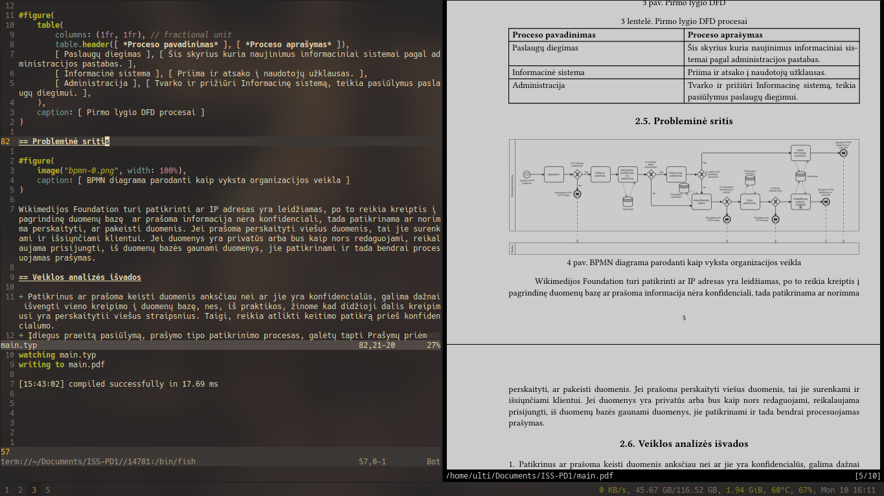

# Pradinis typst darbas skirtas Vilniaus kolegijos dokumentams

[Typst](https://typst.app) yra moderni, paprasta ir stabili Microsoft Word ir LaTeX alternatyva. 
Ji leidžia dokumentus rašyti tekto failuose, veikia su visomis didžiosiomis operacinėmis sistemomis
ir, šiaip, mano nuomone, liuksiškas įrankis.

# Naudojimas

Aš patarčiau instaliuoti [komandos eilutės versiją](https://github.com/typst/typst), nors yra ir Internetinė versija (greičiausia).    
*Beje, pacman turi typst, tai, jei norit instaliuoti taip: `sudo pacman -S typst`*
Ir naudoti komandą:
```sh
typst watch main.typ
```

Instaliavus typst, galite atsisiųsti šią Github „repository“ su komanda
```sh
git clone "https://github.com/Up05/Vilniaus-Kolegija-Typst"
```
*arba, jei neklystu, Github yra ir ten kažkokie tai mygtukai, kur galima .zip failą atsisiųsti...*
 
Mano projekto failų struktūra:
```yml
Vilniaus-Kolegija-Typst:
  - README.md   # Šitas failas
  - main.typ    # Pagrindinis typst failas, čia rašysite patį darbo turinį
  - rules.typ   # Dokumento maketo nustatymai, pvz.: lapo, teksto dydis 
  - title.typ   # Titulinis lapas, čia reikės pakeisti darbo pavadinimą ir dėstytojo pavardę
  - literature.yml # Šaltinių sąrašas ir informacija, naudoti visiškai nebūtina (daugiau info faile)
  - main.pdf    # Išvesties failas, gaunamas su komanda 'typst watch main.typ' arba 'typst compile main.typ'
  - nuotraukos  # viko-logo.jpg yra kolegijos logotipas, jis reikalingas
```

# Pavyzdys

Aš, asmeniškai, naudoju i3, Neovim(kaarmu/typst.vim), zathura ir komandų eilutės typst versiją: 
*Taip, aš irgi pamačiau, kad parašiau „Wikimedijos Foundation“, aš programuotojas, ne koks rašytojas!*

## Darbo pavyzdys

Dar sukūriau [„example1“ šaką](https://github.com/Up05/Vilniaus-Kolegija-Typst/tree/example1).  
Čia yra vienas iš praktinių darbų (su laisva tema, kurios neverta keisti po pirmo(praeito) pusmečio),
pagrinde, aš jį parašiau su typst, taigi, jei norit pavyzdžio, prašom.

Šiandien parašiau ir dar vieną darbą, tai jis bus [„example2“ šakoje](https://github.com/Up05/Vilniaus-Kolegija-Typst/tree/example2).   
Čia mano programos pristatymams struktūriniam programavimui.
